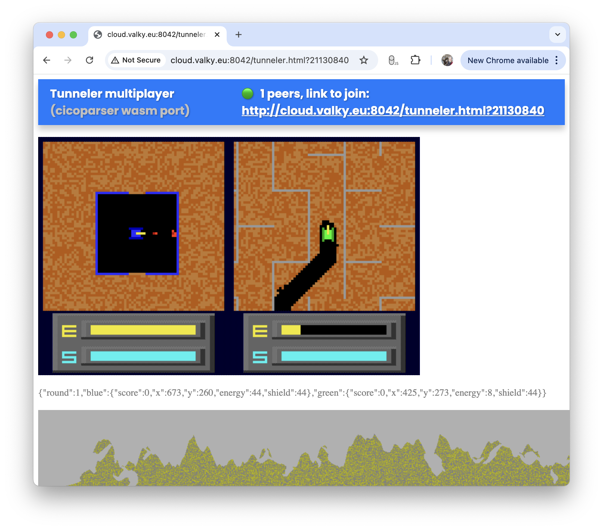

# Tunneler multiplayer

Tunneler by Geoffrey Silverton is a DOS game from 1991 written in Turbo Pascal. With Cicoparser it was converted into C++ and then rebuild with emscripten so it could be played inside browser. This is a proof of concept of turning cicoparser games into network multiplayer game.
You can play it here [http://cloud.valky.eu:8042/tunneler.html](http://cloud.valky.eu:8042/tunneler.html), or you can run it locally with docker/podman. For offline mode, just open the html file: [https://rawgit.valky.eu/gabonator/Projects/refs/heads/master/CicoJit/gamelib/tunneler/netplay/tunneler.html](tunneler.html)

There are a few extras: Maze, full map view, and realtime status of the gameplay. With this information you can add your own modifications - e.g. custom weapons or dynamic map elements, see [fun.js](fun.js) for details

File list:
- game
  - **tunneler.html** - main game
  - **app_inline.js** - wasm binary turned into base64 string (so we can run the game even when opened from local filesystem)
  - **fun.js** - some extras woring directly with the game/pc memory
  - **maze.js** - maze generator
  - **resources.js** - base64 of the main executable
  - **wasmapp.js** - webassembly loader
- mutltiplayer support
  - **server.js** - web server for hosting the game and websocket multiplayer server
- deployment
  - **Dockerfile**
  - **run.sh**
  - **package.json**
- this readme
  - **readme.md**
  - **readme.png**

If you want to see how this game was transcoded into C++, see the above folder
  - **fetch.sh** - downloads or unpacks the game binary
  - **cico.sh** - runs cicoparser to disassemble and transpile the game, applies some patches to fix some issues
  - **cico_js.sh** - converts the C++ source into javascript and places resulting files into **js** folder
  - **wasm/build_wasm.sh** - builds the source code into webassembly binary
  - **wasm/build/** - clean built game

Currently there are three targets when using cicoparser:
  - **plain C++ file** for use with SDL2 library - see **cicorun** folder for source files, run **xcode.sh** to generate Xcode project file
  - **javascript** - see **js** folder
  - **webassembly** - see **wasm** folder