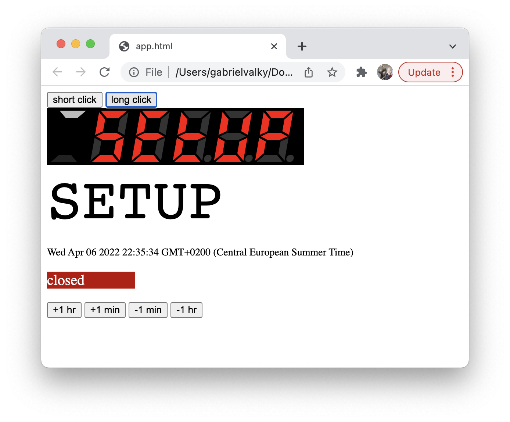
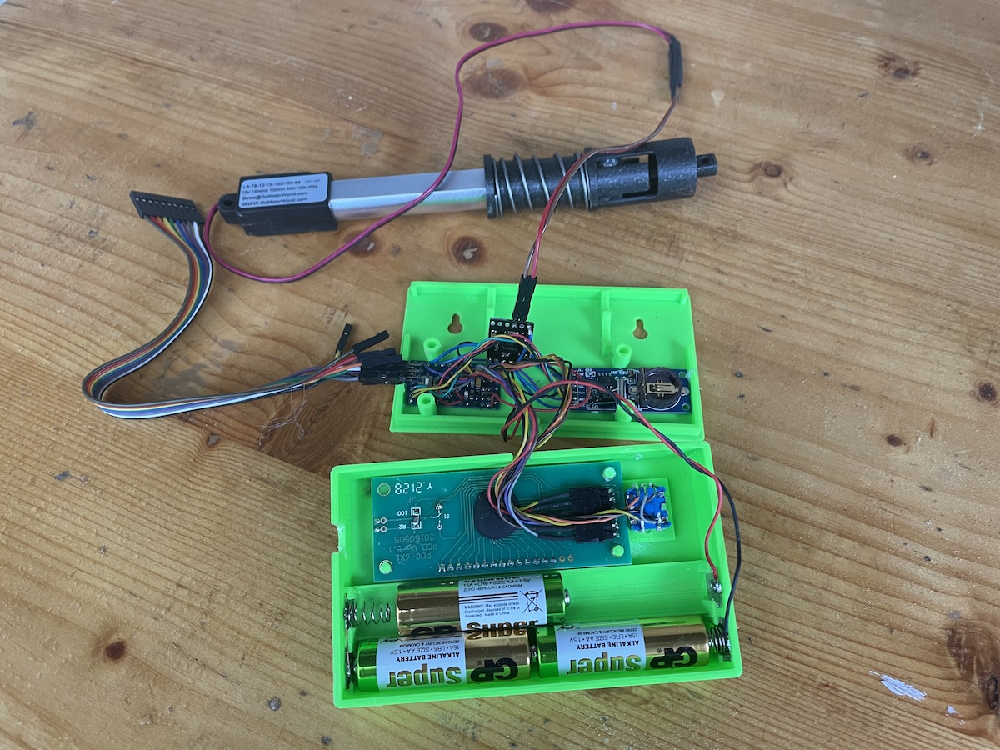
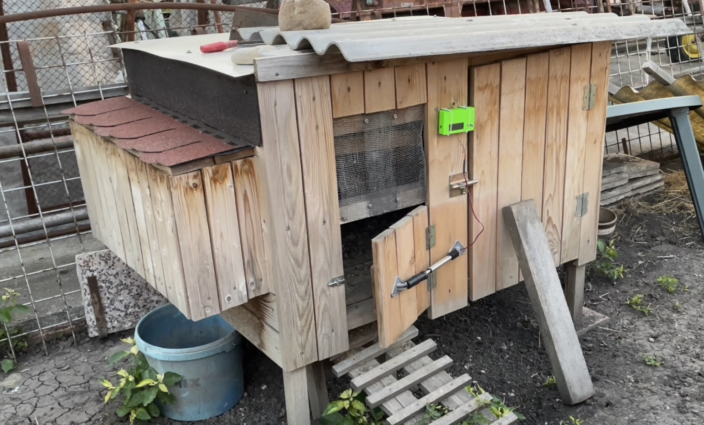

# Automatic coop door

With calculation of sunset/sunrise times. Same project can be built as arduino application and as wasm web application for finetuning the user interface.

Check it [here](https://rawgit.valky.eu/gabonator/Projects/master/CoopDoor/build/app.html)

