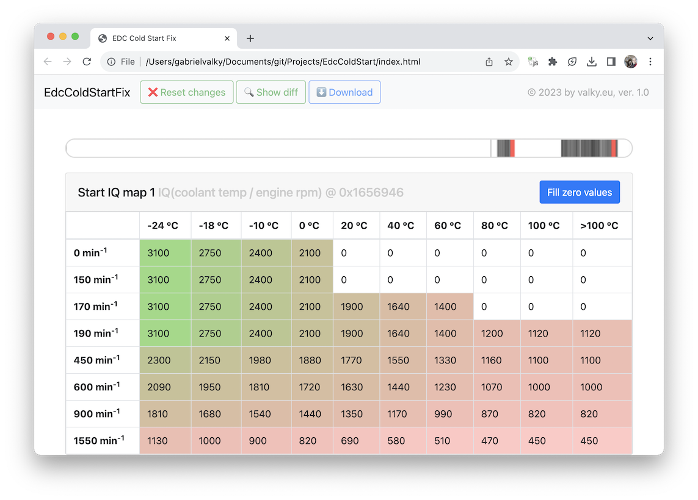

# Cold boot fix

This program takes EDC dumps from MPPS application and patches missing Injection quantity (IQ maps for Start of injection phase) entries. [Test it here](https://rawgit.valky.eu/gabonator/Projects/master/EdcColdStart/index.html)

Links:
  - https://www.techniconnexion.com/t27622-vw-audi-skoda-seat-tdi-90-a-140-resoudre-probleme-demarrage-a-chaud-tuto
  - https://www.edcmasterhp.com/index.php?menu=ecuanalyze (free online EDC dump analyser)
  - https://hajes-racing.com/car-hackers-guide-bosch-edc16u34-basic-functionality-explained/ (hacker guide to EDC16U34