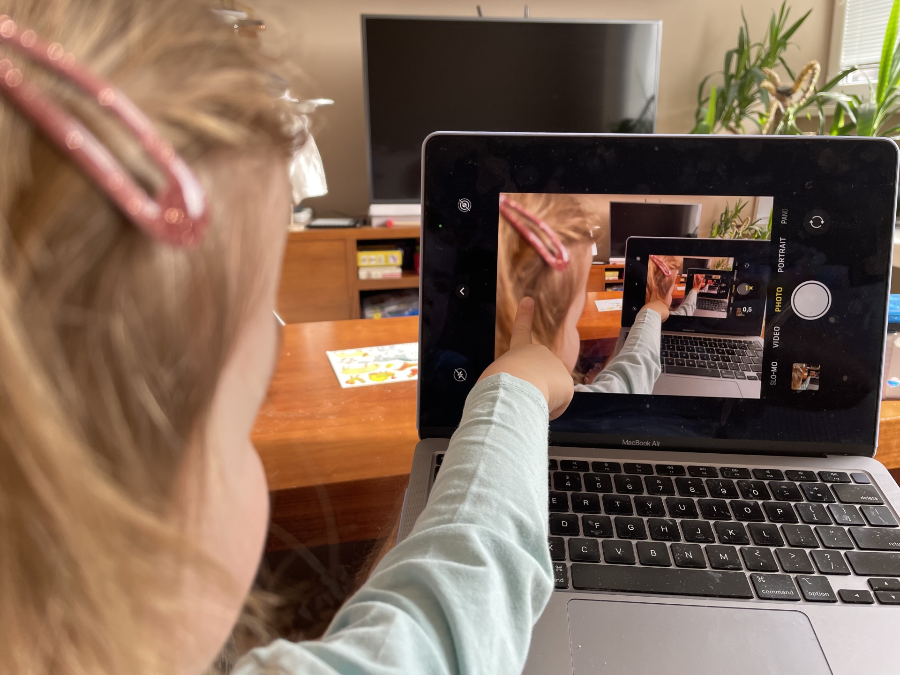

# Homography seamless zooming

This script takes two set of coordinates and calculates homography matrix which transforms them from the initial position into the target position. In my case it was the photo frame on the laptop and photo frame in the mirrored screen.

There are three layer of the animation to make it perfectly seamless:
  - Main layer - where the original image is being transformed by this matrix. For the last 10% of the animation the opacity goes to 0
  - Small image - this image is seen just during the blending phase, its final position is identity (original) and its transformation is inverted homography - it slowly goes from small to original size
  - Large background - this goes from the transformed state into double transformed place - homography multiplied by itself, this layer is placed at the very bottom

To make things even more complicated, for the animation easing you need some curve that nicely matches the zooming (bezier curve is perfect). I had some issues to make all three layers zooming at the same rate and as a workaround I split the animation into 10 keyframes with precalculated matrix values. This makes the code unnecessarily long, but the overall effect looks better.

Just update this configuration and run the HTML. Source points are the coordinates of rectangle corners inside the picture (small rectangle). Dest points are the positions where the source points should be transformed (large rectangle). Duration is in seconds
```js
const bezier = new CubicBezier(0.65,0.32,0.82,0.75);
let source = [[1384, 544], [1563, 549], [1549, 678], [1376, 667]]; // small frame
let dest = [[1065, 412], [1648, 419], [1621, 849], [1054, 827]]; // large frame
const duration = 5;
```js

To create a GIF image, record the animation and use following commands to convert the video into GIF:

```sh
V="Screen Recording 2025-11-08 at 01.06.45.mov"
rm palette.png output.gif
ffmpeg -i "${V}" -vf "trim=start_frame=20:end_frame=240,setpts=PTS-STARTPTS,fps=15,scale=320:-1:flags=lanczos,palettegen" palette.png
ffmpeg -i "${V}" -i palette.png -filter_complex "trim=start_frame=15:end_frame=240,fps=20,scale=320:-1:flags=lanczos[x];[x][1:v]paletteuse" -loop 0 video.gif
```

## Result

### Input



### Output


