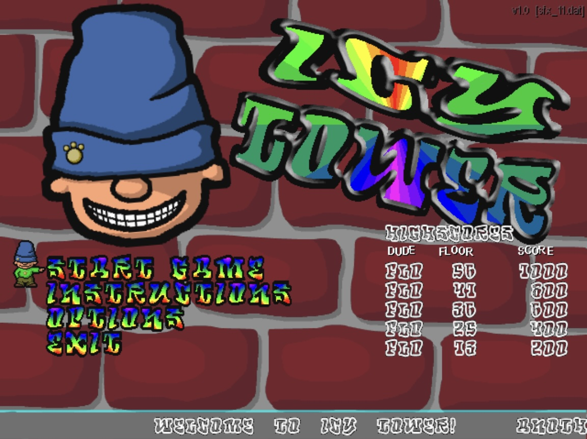

# Icy tower cico port

This is the first Windows game I tried to reverse engineer with cico parser. I was looking long for something small and with as little dependencies as possible. Luckily I found this gem which is written using Allegro library which I used for designing many games in the past. This game is very small and with simple game mechanics, the EXE binary is only 88KB which is something extraordinary in the Win32 world. But for me it was a great opportunity to test how far can cicoparser go. Regarding the dependencies, it only refers to **Kernel32.dll** and **Alleg40.dll**. So the job was to learn how to load the **PE** executable into memory, how to resolve all imported symbols, how to properly emulate FPU and the funny part... how to emulate Allegro library. Because rebuilding it for modern architectures was no go for me. By looking at the gameplay on youtube, it looked that it is just drawing sprites into memory bitmaps, doing some simple 2D transformations, playing some sounds, I just needed to port 10-20 methods and should be fine.

Actually, expectation was not far from reality. It wasn't that difficult, but I had to learn how to read Allegro's datafiles. AI helped a lot with this. How to emulate all sprite operations, making sure that the allocated structures in my emulator match what the game was expecting to see in memory. After I had a decent port as native OSX application with SDL2, I tried to port it to javascript. I could throw away all the C++ methods for rendering rotated and scaled sprites and replaced them with Canvas methods. It made everything much easier. I could even heavily simplify the memory representation of all resource objects since the game didn't require 100% compatibility with Allegro.

Play the [HTML/JS port here]((https://rawgit.valky.eu/gabonator/Projects/refs/heads/master/cicodis32/gamelib/full/icytowerwin32/js/icytower.html) (needs keyboard) 

If you want to see the guts of this port:
- [js/icytower.html](js/icytower.html) - main app, just decompresses `icytower.zip` into memory and runs the game loop
- [js/alleg40.js](js/alleg40.js) - minimal emulation layer of allegro 4.0. HTML5/Canvas makes it very small and tidy
- [js/allegro_datafile.js](js/allegro_datafile.js) - allegro datafile decompressor and resource extraction tool
- [js/controls.js](js/controls.js) - updates allegro keyboard buffer
- [js/cpu.js](js/cpu.js) - registers, memory, stack emulation, etc...
- [js/fflate.js](js/fflate.js) - small ZIP decompressor
- [js/fpu.js](js/fpu.js) - FPU emulation
- [js/icytower.js](js/icytower.js) - cicoparser reverse engineered code
- [js/kernel32.js](js/kernel32.js) - Kernel32.dll emulation

## Why?

Cicoparser started as a fun project to learn better x86 assembly and to make better lightweight ports of old MSDOS games compared to dosbox emulation. Extreme execution speed (30000 fps) makes it a perfect environment for training AI agents on temporally coherent video inputs or for finetuning video encoders. It also allows you to inject your own code and freely modify the game, improve rendering, game mechanics or add new way how to control the game. 

Bringing it to the world of Windows applications makes it a serious reverse engineering tool - it produces a C++ code which you can easily debug, examine, disable or isolate interesting pieces of the program. In comparison with IDA/Ghidra pseudocode tools, cicoparser generates truly working code which you can rely on.

By porting a Win32 application to the web as a lightweight JavaScript app, it can run efficiently on any mobile phone - bringing it to the masses.
